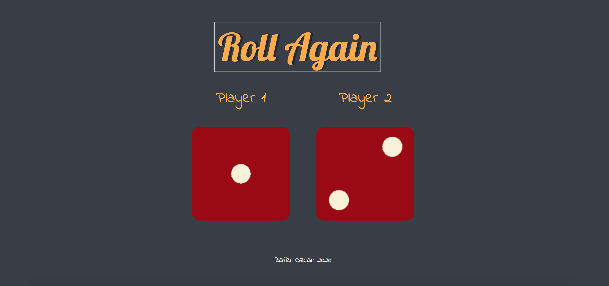

# Dice-Game
Desktop Dice Game 

When refreshing our web site or hit the roll button then our dice get thrown randomly,
player 1 and player 2
both have their own dice values, and our web site will announce a winner depending on whose dice value was higher.

Requirements:

Install
$ git clone 
$ cd PROJECT

Languages & tools
HTML
JavaScript
CSS
